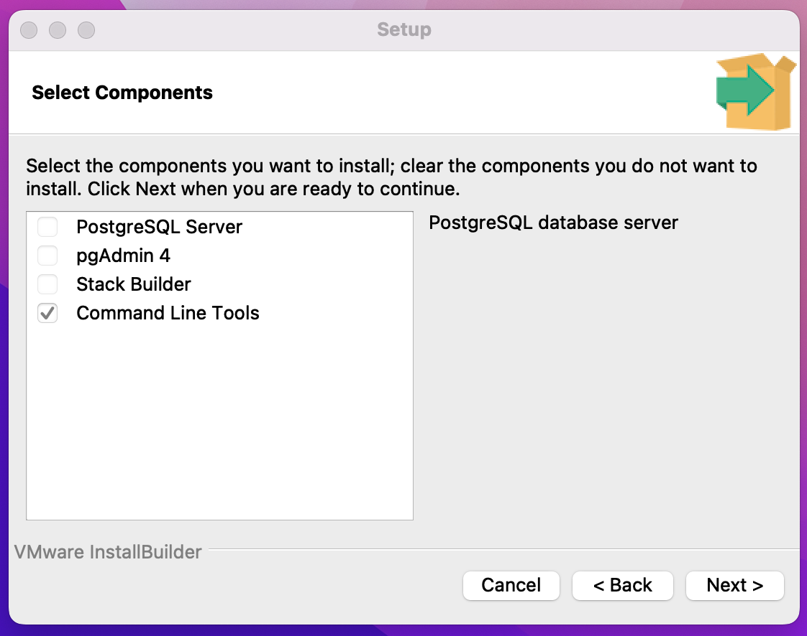

# Troubleshoot Render Deployment Issues - Express

Render offers a straightforward deployment process, but you may run into difficulties. Use the tips and tools below to troubleshoot your deployment.

## Database Issues

Since creating a database is a simple process with the Render GUI, most issues related to the database are not caused by the database creation phase. Instead, they may be caused by errors in configuring your application to run in the production environment (i.e., errors in the project repo) or errors in connecting your application to the Render Postgres database instance (i.e., errors setting up the Web Service in the Render GUI).

### Troubleshooting Project Configuration

Check the following to make sure your project is properly set up to run sqlite in development and Postgres in production:

* Does your configuration file include a production key including the database URL for Postgres?

```JS
// ...
  production: {
    use_env_variable: 'DATABASE_URL',
    dialect: 'postgres',
    // ...
  }
  // ...
```

* Did you include the correct scripts in the backend/package.json and root package.json files?

### Web Service Setup Issues

Check the following fields to make sure your database connection is set up properly:

* Environment variables: Did you include the NODE_ENV variable set to "production" and the DATABASE_URL key set to the "Internal Database URL" value from your Render Postgres database instance?

* Deployment logs: Did each command in your build script and start script run as expected?

* Deployment logs: Did the migration files and seeder files run as expected?

## Checking the Postgres Database (Advanced Troubleshooting)

If you've checked all of the issues described above, you can further troubleshoot your deployment by examining the contents of your Postgres database. In order to do this, you must have PostgreSQL command line tools installed locally on your computer. If you do not have PostgreSQL installed already, follow the directions below to install the tools that will allow you to interact with your database.

### Mac Installation

Navigate to the Postgres Downloads page and click on the icon for the Mac download (latest version). Follow the instructions on the installer. You can choose the default options on each screen except the "Select Components" screen. On that page, select only the "Command Line Tools" option.



When installation is complete, follow the instructions below to interact with your Render database using the PSQL Command Line Tools.

See the Mac Installation Documentation for more details or troubleshooting.

### Windows Installation through WSL

You will install the PostgresQL client tools through WSL. This will allow you to interact with a remotely-hosted PostgresQL server, without the ability to host your own PostgresQL database server.

Open your Ubuntu terminal and enter the following command:

```bash
sudo apt install postgresql-client
```

You will need your Ubuntu user password since you are using sudo.

When installation is complete, follow the instructions below to interact with your Render.com database using the Postgres client through your Ubuntu terminal.

### Interacting with your Database (All)

To access your Render Postgres database, copy the PSQL Command value from the information page of your database in Render. The value should start with "PGPASSWORD=" and should include information about your database.

Paste this value into your terminal. This will open up Postgres with a connection to your remote database. At this point, you can use Postgres commands locally to examine the contents of your database. Try the following:

* `\dn` - lists all of the schemas in the database

  * Does your database show the correct schema for your project? If you did not set up a custom schema for your project, the tables should be within the default "public" schema.

* `\dt <SchemaName>.*` - lists all tables within <SchemaName> schema

  * Do you see all of your tables within the schema? You should see all of your tables, as well as the SequelizeMeta and SequelizeData tables.

* `SELECT * FROM "<SchemaName>"."<TableName>";` - lists all entries in a specific table

* Do your tables show the appropriate data?

If there are any problems with the way the database or schema is set up, you can drop the schema for your application and all tables within it using the following command:

```SQL
DROP SCHEMA <SchemaName> CASCADE
```

Use `Control-d` to close your database connection and exit out of the PSQL Command Line Tools.

**Never commit the PSQL Command string to git. Make sure that any files that may contain this string are in the .gitignore file, and check that the file is properly being ignored by git.**
